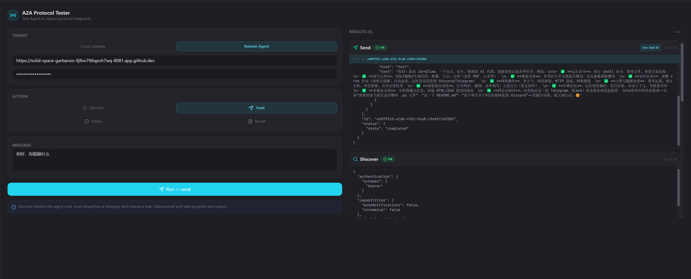
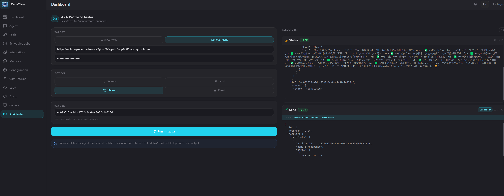
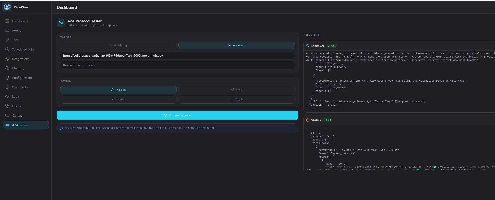
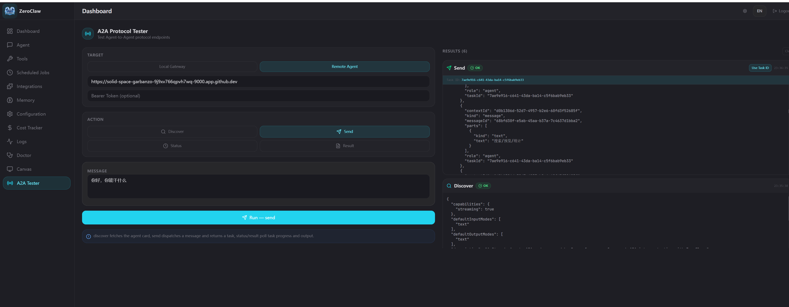
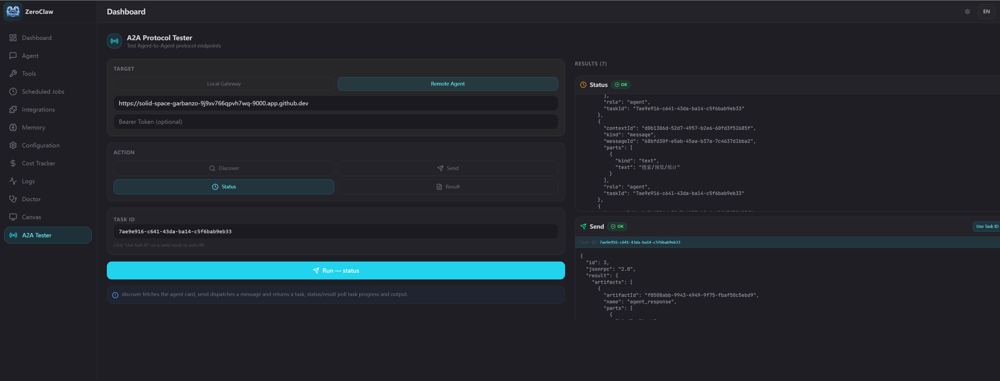
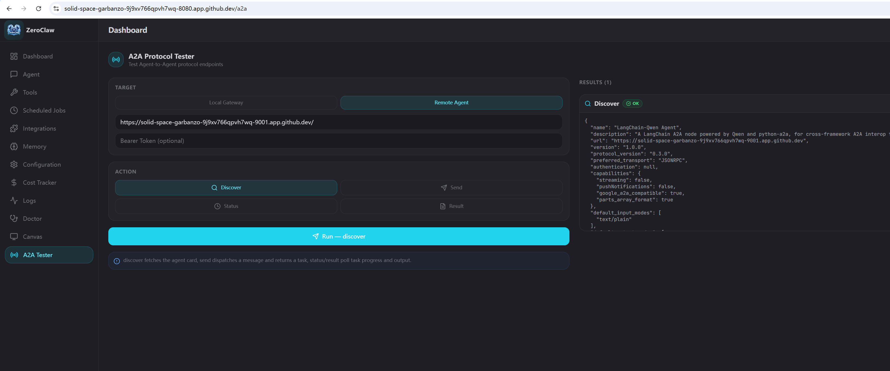
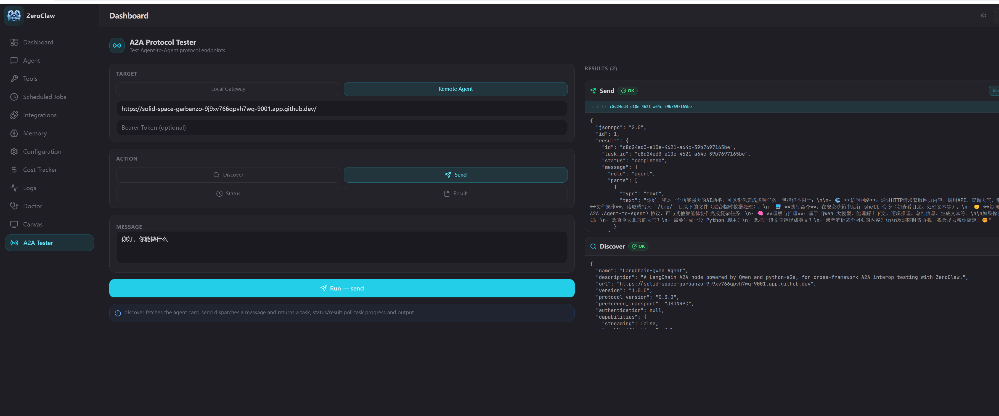
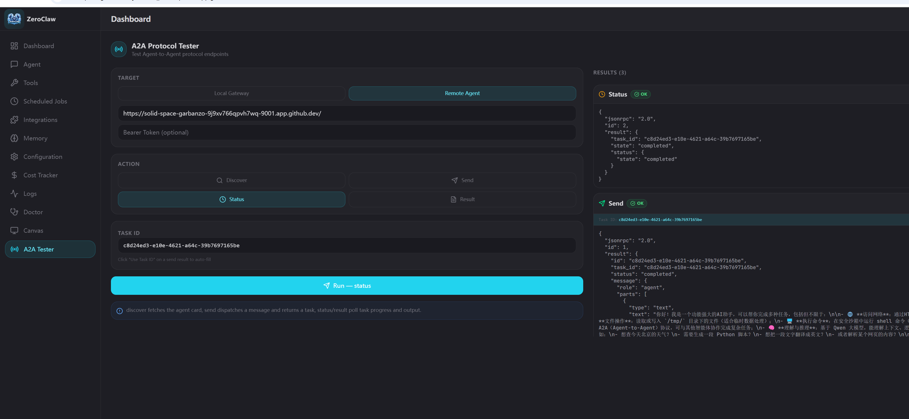

# ZeroClaw 多 Agent A2A 通信测试报告

> 环境：GitHub Codespaces
> 版本：v0.6.4
> 协议：A2A (Agent-to-Agent) Protocol MVP

---

## 一、目标

在 GitHub Codespaces 环境中构建多 Agent A2A 通信测试场景，验证以下能力：

1. **同框架互通**：两个 ZeroClaw 实例（Agent-A、Agent-B）通过 A2A 协议互相发现并通信
2. **跨框架互通**：ZeroClaw 实例与第三方 Python 框架实例互通，包括：
   - **Strands Agents** - 使用 Strands SDK 实现的 A2A Agent
   - **LangChain A2A** - 使用 LangChain + python-a2a 实现的 A2A Agent
3. **多框架对比**：验证不同实现（Rust 原生、Strands SDK、python-a2a 库）的 A2A 协议兼容性
4. **端到端测试**：在单个 ZeroClaw Web UI 中完成对所有远端 Agent 的发现、消息发送、状态查询和结果获取

通过本测试，确认 A2A 协议能够作为异构 Agent 系统之间的通用通信标准，支持不同语言（Rust、Python）和不同框架（原生、Strands、LangChain）的互操作，为构建多 Agent 协作网络提供基础。

---

## 二、配置修改

### Agent-A 配置（`/tmp/zeroclaw-a/config.toml`）

```toml
default_provider = "qwen"
default_model = "qwen-plus"
default_temperature = 0.7
api_key = "<your-api-key>"

[gateway]
port = 8080
host = "0.0.0.0"
allow_public_bind = true
require_pairing = false

[a2a]
enabled = true
agent_name = "Agent-A"
description = "A2A Test Agent A - Alpha node"
public_url = "https://<CODESPACE_NAME>-8080.app.github.dev"
bearer_token = "a2a-shared-secret"
allow_local = true

[cost]
enabled = false
```

关键配置项说明：

| 配置项 | 值 | 原因 |
|---|---|---|
| `gateway.host` | `0.0.0.0` | 绑定所有网卡，Codespaces 端口转发需要 |
| `gateway.allow_public_bind` | `true` | 允许绑定非 localhost，否则启动报错 |
| `gateway.require_pairing` | `false` | 测试阶段关闭配对验证，简化测试流程 |
| `a2a.enabled` | `true` | 开启 A2A 服务端和出站工具 |
| `a2a.public_url` | Codespaces 公网域名 | Agent Card 中对外声明的服务地址，必须是外部可达的 URL |
| `a2a.bearer_token` | `a2a-shared-secret` | A2A 请求认证 Token，两端保持一致 |
| `a2a.allow_local` | `true` | 允许出站 A2A 工具访问本地地址（开发环境用） |
| `cost.enabled` | `false` | 关闭费用追踪，防止预算上限拦截测试请求（见附注） |

> **`cost.enabled` 说明**
>
> `[cost]` 是 ZeroClaw 的费用追踪与预算管控模块，**默认开启**。开启时会统计每次 LLM 调用的 token 消耗和估算费用，并在达到预算阈值（默认日限 $10、月限 $100）时触发告警或拦截。
>
> 测试配置中将其关闭，是为了避免在 A2A 通信验证过程中因触发预算上限导致请求被意外拦截。**正式部署时建议去掉此行（保持默认开启），或根据实际需求配置 `daily_limit_usd` / `monthly_limit_usd`。**

---

### Agent-B 配置（`/tmp/zeroclaw-b/config.toml`）

```toml
default_provider = "qwen"
default_model = "qwen-plus"
default_temperature = 0.7
api_key = "<your-api-key>"

[gateway]
port = 8081
host = "0.0.0.0"
allow_public_bind = true
require_pairing = false

[a2a]
enabled = true
agent_name = "Agent-B"
description = "A2A Test Agent B - Beta node"
public_url = "https://<CODESPACE_NAME>-8081.app.github.dev"
bearer_token = "a2a-shared-secret"
allow_local = true

[cost]
enabled = false
```

与 Agent-A 的差异：

| 配置项 | Agent-A | Agent-B |
|---|---|---|
| `gateway.port` | `8080` | `8081` |
| `a2a.agent_name` | `Agent-A` | `Agent-B` |
| `a2a.description` | Alpha node | Beta node |
| `a2a.public_url` | `...-8080.app.github.dev` | `...-8081.app.github.dev` |

两个实例的 `bearer_token` 相同（`a2a-shared-secret`），使 Agent-A 可以直接向 Agent-B 发起认证请求。

---

### Strands-Qwen Agent（Python，端口 9000）

这是一个基于 **Strands Agents SDK** 的第三方 A2A 实现，用于验证 ZeroClaw 与 Python 框架的跨框架互通。

---

### LangChain-Qwen Agent（Python，端口 9001）

这是一个基于 **LangChain + python-a2a** 的第三方 A2A 实现，用于验证 ZeroClaw 与 LangChain 生态的跨框架互通。

**依赖安装：**

```bash
cd python
pip install -r requirements-langchain-a2a.txt
```

**启动脚本：** `python/langchain_a2a_server.py`

关键配置说明：

| 配置项 | 值 | 说明 |
|---|---|---|
| `HOST` | `0.0.0.0` | 绑定所有网卡，Codespaces 需要 |
| `PORT` | `9001` | A2A 服务端口号 |
| `PUBLIC_URL` | `https://<CODESPACE>-9001.app.github.dev` | Agent Card 中声明的公网地址 |
| `API_KEY` | 环境变量 `QWEN_API_KEY` | Qwen API 密钥 |
| `base_url` | `https://dashscope.aliyuncs.com/compatible-mode/v1` | Qwen OpenAI 兼容接口 |
| `model` | `qwen-plus` | 使用的模型 |
| `name` | `LangChain-Qwen Agent` | Agent 名称 |
| `tools` | `http_request, shell, file_read, file_write` | 启用的工具 |
| `allow_origins` | `*` | CORS 允许所有来源 |
| A2A 库 | `python-a2a` | 社区 A2A 实现 |

**启动命令：**

```bash
export QWEN_API_KEY=<your-key>
python python/langchain_a2a_server.py
```

**LangChain Agent 与 Strands/ZeroClaw Agent 的关键差异：**

| 特性 | LangChain Agent | Strands Agent | ZeroClaw Agent |
|---|---|---|---|
| 实现语言 | Python | Python | Rust |
| SDK | LangChain + python-a2a | Strands Agents | ZeroClaw 原生 |
| A2A 实现 | python-a2a (社区) | Strands A2A (内置) | 原生实现 |
| LLM 后端 | Qwen via OpenAI 兼容接口 | Qwen via OpenAI 兼容接口 | Qwen 原生 |
| 默认端口 | `9001` | `9000` | `42617` |
| 认证 | 默认无 bearer token | 默认无 bearer token | `a2a-shared-secret` |
| 流式支持 | `streaming: false` | `streaming: true` | 未实现（MVP） |
| Agent 模式 | ReAct | Strands Agent | 原生编排 |

**依赖安装：**

```bash
cd python
pip install -r requirements-strands.txt
```

**启动脚本：** `python/strands_a2a_server.py`

关键配置说明：

| 配置项 | 值 | 说明 |
|---|---|---|
| `HOST` | `0.0.0.0` | 绑定所有网卡，Codespaces 需要 |
| `PORT` | `9000` | A2A 服务端口号 |
| `PUBLIC_URL` | `https://<CODESPACE>-9000.app.github.dev` | Agent Card 中声明的公网地址 |
| `API_KEY` | 环境变量 `QWEN_API_KEY` | Qwen API 密钥 |
| `base_url` | `https://dashscope.aliyuncs.com/compatible-mode/v1` | Qwen OpenAI 兼容接口 |
| `model_id` | `qwen-plus` | 使用的模型 |
| `name` | `Strands-Qwen Agent` | Agent 名称 |
| `description` | 自定义描述 | Agent Card 中显示 |
| `tools` | `http_request, shell, file_read, file_write` | 启用的工具 |
| `allow_origins` | `*` | CORS 允许所有来源 |
| `/a2a` 路由 | 代理到 `/` | ZeroClaw 兼容性（Strands 默认用 `/`） |

**启动命令：**

```bash
export QWEN_API_KEY=<your-key>
python python/strands_a2a_server.py
```

**Strands Agent 与 ZeroClaw Agent 的关键差异：**

| 特性 | Strands Agent | ZeroClaw Agent |
|---|---|---|
| 实现语言 | Python | Rust |
| SDK | Strands Agents | ZeroClaw 原生 |
| LLM 后端 | Qwen via OpenAI 兼容接口 | Qwen 原生 |
| 默认端口 | `9000` | `42617` |
| 认证 | 默认无 bearer token | `a2a-shared-secret` |
| 流式支持 | `streaming: true` | 未实现（MVP） |
| 工具注册 | `strands_tools` 自动暴露 | 需手动配置 |

Strands A2A 实例默认无 bearer token 认证，ZeroClaw 调用时留空 Bearer Token 即可。

---

## 三、关于配置目录的选择

### 测试环境（本文使用）

本文使用 `/tmp/zeroclaw-a` 和 `/tmp/zeroclaw-b` 作为配置目录，原因是 `/tmp` 创建快速，无需关心清理，适合一次性测试。

**注意：`/tmp` 是临时目录，系统重启后会被清空**，其中的会话数据、workspace 等均不会保留，仅适用于临时测试。

### 正式部署

ZeroClaw 的默认配置目录是 `~/.zeroclaw/`，不加 `--config-dir` 参数时进程自动读取 `~/.zeroclaw/config.toml`。

多实例正式部署的推荐做法是使用具名的持久化目录：

```bash
# 目录结构示例
~/.zeroclaw-agent-a/config.toml
~/.zeroclaw-agent-b/config.toml
```

启动：

```bash
zeroclaw --config-dir ~/.zeroclaw-agent-a gateway start
zeroclaw --config-dir ~/.zeroclaw-agent-b gateway start
```

数据、workspace、SQLite 会话等均持久化在各自目录下，重启后不丢失。若只部署单实例，直接使用默认目录 `~/.zeroclaw/` 即可，无需任何额外参数。

---

## 四、Codespaces 启动步骤

### 1. 准备独立配置目录

每个实例需要独立的配置目录，避免互相干扰：

```bash
mkdir -p /tmp/zeroclaw-a /tmp/zeroclaw-b
```

将各自的 config.toml 写入对应目录（注意将 `<CODESPACE_NAME>` 替换为实际值）：

```bash
# 查看当前 Codespace 名称
echo $CODESPACE_NAME
```

`public_url` 格式为：

```
https://<CODESPACE_NAME>-<PORT>.app.github.dev
```

### 2. 启动三个实例

**ZeroClaw Agent-A / Agent-B：**

使用 `--config-dir` 指定配置目录（不能用环境变量，必须用此参数）：

```bash
# 启动 Agent-A（后台运行）
zeroclaw --config-dir /tmp/zeroclaw-a gateway start > /tmp/agent-a.log 2>&1 &

# 启动 Agent-B（后台运行）
zeroclaw --config-dir /tmp/zeroclaw-b gateway start > /tmp/agent-b.log 2>&1 &
```

确认启动成功（日志中应出现 `A2A protocol enabled`）：

```bash
cat /tmp/agent-a.log
cat /tmp/agent-b.log
```

**Strands Agent（Python，端口 9000）：**

```bash
export QWEN_API_KEY=<your-key>
python python/strands_a2a_server.py > /tmp/strands-a2a.log 2>&1 &
```

确认启动成功（日志中应出现 `Uvicorn running on http://0.0.0.0:9000`）：

```bash
cat /tmp/strands-a2a.log
```

**LangChain Agent（Python，端口 9001）：**

```bash
export QWEN_API_KEY=<your-key>
python python/langchain_a2a_server.py > /tmp/langchain-a2a.log 2>&1 &
```

确认启动成功（日志中应出现 `Uvicorn running on http://0.0.0.0:9001`）：

```bash
cat /tmp/langchain-a2a.log
```

### 3. 开放 Codespaces 端口可见性

Codespaces 端口默认为 **Private**，浏览器跨端口请求会被拦截，导致 UI 中的 Remote Agent 测试失败。

操作步骤：
1. 打开 VS Code 底部 **Ports** 面板（或 GitHub Codespaces 网页的 Ports 标签）
2. 找到端口 `8080`、`8081`、`9000` 和 `9001`
3. 右键 → **Port Visibility** → 改为 **Public**（或 Organization）

### 4. 验证端点可用性

```bash
# 验证 Agent-A
curl http://localhost:8080/.well-known/agent-card.json

# 验证 Agent-B
curl http://localhost:8081/.well-known/agent-card.json

# 验证 Strands Agent
curl http://localhost:9000/.well-known/agent-card.json

# 验证 LangChain Agent
curl http://localhost:9001/.well-known/agent-card.json
```

四者均应返回包含各自 `agent_name` 和 Codespaces `public_url` 的 JSON。不同 Agent 的 `capabilities.streaming` 值可能不同（Strands 为 `true`，LangChain 和 ZeroClaw 为 `false`），体现跨框架差异。

---

## 五、在一个 ZeroClaw UI 中测试多框架 A2A 通信

本章节介绍如何在**单个 ZeroClaw 实例的 Web UI**中，同时测试与 **Strands Agent**（Python SDK）和 **LangChain Agent**（python-a2a 库）的跨框架 A2A 通信。

### 5.0 快速启动所有服务

使用提供的启动脚本一键启动三个服务：

```bash
export QWEN_API_KEY=sk-xxxx
./python/start_a2a_servers.sh
```

脚本会自动启动：
- **ZeroClaw** (端口 8080) - 作为测试主控
- **Strands Agent** (端口 9000) - Python Strands SDK 实现
- **LangChain A2A** (端口 9001) - Python LangChain + python-a2a 实现

并尝试自动设置 Codespaces 端口为 Public。

---

### 5.1 打开 ZeroClaw Dashboard

访问 Web Dashboard：

```
https://<CODESPACE_NAME>-8080.app.github.dev
```

进入左侧菜单 **A2A Test** 页面。

---

### 5.2 测试与 Strands Agent（Python SDK）的跨框架通信

#### 配置

点击 **Remote Agent** 切换到远端模式，填写：

| 字段 | 填写值 |
|---|---|
| Agent URL | `https://<CODESPACE_NAME>-9000.app.github.dev` |
| Bearer Token | （留空，Strands 默认无认证） |

#### 测试步骤

**Step 1 — 发现（discover）**

选择 `discover`，点击 Run。

预期结果：返回 Strands Agent 的 Agent Card，注意 `capabilities.streaming: true`（与 ZeroClaw 不同）。

**Step 2 — 发送消息（send）**

选择 `send`，输入消息如"你好，你能做什么？"，点击 Run。

预期结果：Strands Agent 返回响应，结果卡片中显示 **"Use Task ID"** 按钮。

**Step 3 — 查询状态（status）**

点击 **"Use Task ID"** 按钮自动填充 Task ID，切换到 `status`，点击 Run。

预期结果：返回 `state: completed`。

---

### 5.3 测试与 LangChain Agent（python-a2a）的跨框架通信

#### 配置

点击 **Remote Agent**，修改配置：

| 字段 | 填写值 |
|---|---|
| Agent URL | `https://<CODESPACE_NAME>-9001.app.github.dev` |
| Bearer Token | （留空，LangChain Agent 默认无认证） |

#### 测试步骤

与 5.2 相同，执行 discover → send → status。

**预期差异对比**：

| 特性 | Strands Agent | LangChain Agent |
|------|---------------|-----------------|
| SDK | Strands Agents SDK | LangChain + python-a2a |
| `streaming` | `true` | `false` |
| Agent 模式 | Strands Agent | ReAct |
| 响应风格 | 结构化 JSON | 自然语言 |

---

### 5.4 多 Agent 协作测试（可选）

你可以在 ZeroClaw 的 Chat 页面中，让 ZeroClaw Agent 同时调用多个远端 Agent：

1. 确保远端 Agent 的端口已开放
2. 在 Chat 中发送消息："请同时询问 Strands Agent 和 LangChain Agent 他们能做什么，然后总结他们的回答"
3. ZeroClaw 会通过 A2A 协议分别调用两个 Agent，并整合结果

**预期差异：**
- Strands Agent 的 agent card 中 `capabilities.streaming: true`（ZeroClaw 为 `false`）
- Strands Agent 的 `skills` 列表包含 `http_request`、`shell`、`file_read`、`file_write` 等工具描述
- 由于 Strands 和 ZeroClaw 的 LLM 后端相同（均为 Qwen），响应质量应相当

---

### 5.3 测试与 LangChain Agent（Python）的跨框架通信

点击 **Remote Agent** 切换到远端模式，填写：

| 字段 | 填写值 |
|---|---|
| Agent URL | `https://<CODESPACE_NAME>-9001.app.github.dev` |
| Bearer Token | （留空，LangChain Agent 默认无认证） |

#### 测试步骤

与 5.1 相同，执行 discover → send → status → result。

**预期差异：**
- LangChain Agent 的 agent card 中 `capabilities.streaming: false`（与 ZeroClaw 相同）
- LangChain Agent 使用 `python-a2a` 社区库实现 A2A 协议
- 基于 ReAct 模式的 Agent 架构，与 Strands 的 Agent 模式不同

---

## 六、实际运行截图

以下截图来自 ZeroClaw Web Dashboard A2A Tester 页面，展示在**同一个 UI**中与不同框架 Agent 的通信结果。

### 6.1 与 ZeroClaw Agent（同框架）通信

**截图 1 — Discover：拉取 ZeroClaw Agent-B 的 Agent Card**


填入 ZeroClaw Agent-B 地址（端口 8081），执行 Discover。注意响应中 `capabilities.streaming: false`，`bearer` 认证方式为 `bearer`，与跨框架 Agent 不同。

---

**截图 2 — Send：向 ZeroClaw Agent-B 发送消息**



发送"你好，你能做什么？"，ZeroClaw Agent-B 返回 task_id。同框架通信使用相同的 `bearer_token` 进行认证。

---

**截图 3 — Status：查询 ZeroClaw Agent-B 任务状态**



执行 Status 查询，ZeroClaw Agent-B 返回 `state: completed`。同框架互通验证成功。

---

### 6.2 与 Strands Agent（跨框架）通信

**截图 4 — Discover：拉取 Strands Agent 的 Agent Card**



填入 Strands Agent 地址（端口 9000），执行 Discover。注意响应中 `capabilities.streaming: true`，体现 Strands SDK 的流式支持能力。

---

**截图 5 — Send：向 Strands Agent 发送消息**



发送"你好，你能干什么"，Strands Agent 返回 task_id。结果卡片中显示 **"Use Task ID"** 按钮，点击可自动填充到 Task ID 输入框。

---

**截图 6 — Status：查询 Strands Agent 任务状态**



执行 Status 查询，Strands 返回 `state: completed` 和完整的 artifacts。跨框架通信验证成功。

---

### 6.2 与 LangChain Agent（跨框架）通信

**截图 7 — Discover：拉取 LangChain Agent 的 Agent Card**



填入 LangChain Agent 地址（端口 9001），执行 Discover。注意响应中 `capabilities.streaming: false`（与 ZeroClaw 相同），体现 python-a2a 库的实现特点。

---

**截图 8 — Send：向 LangChain Agent 发送消息**



发送"你好，你能做什么？"，LangChain Agent 返回 task_id。基于 ReAct 模式的 Agent 返回自然语言响应，结果卡片中显示 **"Use Task ID"** 按钮。

---

**截图 9 — Status：查询 LangChain Agent 任务状态**



执行 Status 查询，LangChain Agent 返回 `state: completed`。使用 `python-a2a` 库实现的 A2A 协议与 ZeroClaw 原生实现互通成功。

---

### 6.3 三种实现对比总结

| 测试项 | ZeroClaw (Rust) | Strands Agent | LangChain Agent |
|--------|-----------------|---------------|-----------------|
| **Discover** | ✅ 返回 Agent Card | ✅ 返回 Agent Card | ✅ 返回 Agent Card |
| **Send** | ✅ 返回 task_id | ✅ 返回 task_id | ✅ 返回 task_id |
| **Status** | ✅ `state: completed` | ✅ `state: completed` | ✅ `state: completed` |
| **Result** | ✅ 返回 artifacts | ✅ 返回 artifacts | ✅ 返回响应内容 |
| **认证方式** | Bearer Token | 无认证 | 无认证 |
| **Streaming** | ❌ 不支持 | ✅ 支持 | ❌ 不支持 |

**结论**：A2A 协议成功实现了三种不同实现（Rust ZeroClaw 原生、Python Strands SDK、Python LangChain + python-a2a）之间的完全互操作性。

---

## 七、常见问题

**启动时报 `Address already in use`**

端口被占用，使用以下命令停止所有服务后重试：
```bash
pkill -f 'zeroclaw.*gateway start'
pkill -f 'strands_a2a_server'
pkill -f 'langchain_a2a_server'
```

**`discover` 在 UI 中报网络错误**

Codespaces 端口可见性为 Private，需要改为 Public：

**自动设置（推荐）**：
```bash
gh codespace ports visibility 8080:public -c $CODESPACE_NAME
gh codespace ports visibility 9000:public -c $CODESPACE_NAME
gh codespace ports visibility 9001:public -c $CODESPACE_NAME
```

**手动设置**：
1. 打开 VS Code 底部 **Ports** 面板
2. 右键端口 8080、9000、9001 → **Port Visibility** → **Public**

**注意**：使用 `./python/start_a2a_servers.sh` 脚本会自动尝试设置端口为 Public。

**`send` 返回 HTTP 401**

- **ZeroClaw → ZeroClaw**: 检查 `bearer_token` 是否一致
- **ZeroClaw → Strands/LangChain**: 留空 Bearer Token（第三方 Agent 默认无认证）

**agent card 中 `url` 仍是 `localhost`**

`a2a.public_url` 未正确设置。使用启动脚本会自动配置，或手动修改 `config.toml` 中的 `public_url` 为 Codespaces 域名。

**UI 中 "Use Task ID" 按钮不显示**

LangChain Server 返回的响应格式问题。确保响应中包含 `result.id` 字段（已修复）。

**`status` 查询返回 `state: unknown`**

ZeroClaw UI 使用 `params.id` 而不是 `params.task_id` 查询任务。LangChain Server 已兼容两种格式。

---

## 附录 A：Strands Agent 完整代码

**文件**: `python/strands_a2a_server.py`

```python
"""
Strands Agents A2A Server (with CORS support)
=============================================
A Python A2A-compatible agent powered by Strands Agents SDK and Qwen LLM.
Runs on port 9000 and can communicate with ZeroClaw agents via the A2A protocol.

Features:
- CORS enabled for cross-origin requests from ZeroClaw UI
- /a2a endpoint for ZeroClaw compatibility (Strands uses / by default)
- Qwen LLM via OpenAI-compatible API
- Tools: http_request, shell, file_read, file_write

Usage:
    export QWEN_API_KEY=<your-key>
    python strands_a2a_server.py

Optional:
    export CODESPACE_NAME=<name>   # auto-set in GitHub Codespaces
    export PORT=9000               # override default port
"""

import logging
import os

import httpx
import uvicorn
from openai import AsyncOpenAI
from starlette.applications import Starlette
from starlette.middleware.cors import CORSMiddleware
from starlette.requests import Request
from starlette.responses import Response
from starlette.routing import Mount, Route
from strands import Agent
from strands.models.openai import OpenAIModel
from strands.multiagent.a2a import A2AServer
from strands_tools import file_read, file_write, http_request, shell

logging.basicConfig(
    level=logging.INFO,
    format="%(asctime)s [%(levelname)s] %(name)s: %(message)s",
)
logger = logging.getLogger(__name__)

# ── Configuration ─────────────────────────────────────────────────

API_KEY = os.environ.get("QWEN_API_KEY") or os.environ.get("API_KEY")
if not API_KEY:
    raise RuntimeError(
        "QWEN_API_KEY (or API_KEY) environment variable is required.\n"
        "Example: export QWEN_API_KEY=sk-xxxx"
    )

PORT = int(os.environ.get("PORT", "9000"))
HOST = "0.0.0.0"

# Derive the public URL for the A2A agent card.
# In Codespaces, CODESPACE_NAME is automatically set.
CODESPACE_NAME = os.environ.get("CODESPACE_NAME", "")
if CODESPACE_NAME:
    PUBLIC_URL = f"https://{CODESPACE_NAME}-{PORT}.app.github.dev"
else:
    PUBLIC_URL = f"http://localhost:{PORT}"

logger.info("Public URL: %s", PUBLIC_URL)

# ── LLM Model ────────────────────────────────────────────────────

qwen_client = AsyncOpenAI(
    api_key=API_KEY,
    base_url="https://dashscope.aliyuncs.com/compatible-mode/v1",
)

model = OpenAIModel(
    client=qwen_client,
    model_id="qwen-plus",
)

# ── Agent ─────────────────────────────────────────────────────────

agent = Agent(
    model=model,
    name="Strands-Qwen Agent",
    description="A Strands Agents A2A node powered by Qwen, for cross-framework A2A interop testing with ZeroClaw.",
    tools=[http_request, shell, file_read, file_write],
    system_prompt=(
        "You are a helpful AI assistant powered by Qwen via the Strands Agents framework. "
        "You can execute shell commands, read/write files, and make HTTP requests. "
        "You communicate with other agents using the A2A protocol."
    ),
)

# ── A2A Server with CORS and /a2a route ───────────────────────────

# Create Strands A2A server instance
a2a_server = A2AServer(
    agent=agent,
    host=HOST,
    port=PORT,
    http_url=PUBLIC_URL,
)

# Build Starlette app from A2A server (this has routes on /)
a2a_app = a2a_server.to_starlette_app()


# Proxy handler for /a2a -> /
async def a2a_proxy(request: Request) -> Response:
    """Proxy /a2a requests to / for ZeroClaw compatibility."""
    body = await request.body()
    
    async with httpx.AsyncClient() as client:
        try:
            response = await client.post(
                f"http://localhost:{PORT}/",
                content=body,
                headers={
                    "Content-Type": request.headers.get("Content-Type", "application/json"),
                    "Authorization": request.headers.get("Authorization", ""),
                },
                timeout=60.0,
            )
            return Response(
                content=response.content,
                status_code=response.status_code,
                headers={
                    "Content-Type": "application/json",
                    "Access-Control-Allow-Origin": "*",
                },
            )
        except Exception as e:
            logger.error("Proxy error: %s", e)
            return Response(
                content=f'{{"jsonrpc":"2.0","error":{{"code":-32000,"message":"Proxy error: {e}"}}}}'.encode(),
                status_code=500,
                media_type="application/json",
            )


# Create parent app with explicit routes
# Order matters: /a2a must be before the catch-all mount
routes = [
    Route("/a2a", a2a_proxy, methods=["POST"]),
    Mount("/", app=a2a_app),
]

app = Starlette(routes=routes)

# Add CORS middleware
app.add_middleware(
    CORSMiddleware,
    allow_origins=["*"],
    allow_credentials=True,
    allow_methods=["*"],
    allow_headers=["*"],
)

# ── Entrypoint ────────────────────────────────────────────────────

if __name__ == "__main__":
    logger.info("Starting Strands A2A server on %s:%d", HOST, PORT)
    logger.info("Agent card: %s/.well-known/agent-card.json", PUBLIC_URL)
    logger.info("CORS enabled for cross-origin requests")
    logger.info("ZeroClaw compatible endpoint: %s/a2a", PUBLIC_URL)
    uvicorn.run(app, host=HOST, port=PORT)
```

---

## 附录 B：LangChain A2A Server 完整代码

**文件**: `python/langchain_a2a_server.py`

```python
"""
LangChain A2A Server (with python-a2a)
======================================
A Python A2A-compatible agent powered by LangChain and Qwen LLM.
Uses python-a2a library for A2A protocol implementation.
Runs on port 9001 and can communicate with ZeroClaw agents via the A2A protocol.

Usage:
    export QWEN_API_KEY=<your-key>
    python langchain_a2a_server.py
"""

import json
import logging
import os
import subprocess
import uuid
from datetime import datetime
from typing import Any, Dict, List, Optional

import httpx
import uvicorn
from langchain_core.tools import Tool
from langchain_core.messages import HumanMessage, SystemMessage
from langchain_openai import ChatOpenAI
from starlette.applications import Starlette
from starlette.middleware.cors import CORSMiddleware
from starlette.requests import Request
from starlette.responses import JSONResponse, Response
from starlette.routing import Route

logging.basicConfig(
    level=logging.INFO,
    format="%(asctime)s [%(levelname)s] %(name)s: %(message)s",
)
logger = logging.getLogger(__name__)

# ── Configuration ─────────────────────────────────────────────────

API_KEY = os.environ.get("QWEN_API_KEY") or os.environ.get("API_KEY")
if not API_KEY:
    raise RuntimeError(
        "QWEN_API_KEY (or API_KEY) environment variable is required.\n"
        "Example: export QWEN_API_KEY=sk-xxxx"
    )

PORT = int(os.environ.get("PORT", "9001"))
HOST = "0.0.0.0"

CODESPACE_NAME = os.environ.get("CODESPACE_NAME", "")
if CODESPACE_NAME:
    PUBLIC_URL = f"https://{CODESPACE_NAME}-{PORT}.app.github.dev"
else:
    PUBLIC_URL = f"http://localhost:{PORT}"

logger.info("Public URL: %s", PUBLIC_URL)

# ── LangChain LLM ────────────────────────────────────────────────

llm = ChatOpenAI(
    api_key=API_KEY,
    base_url="https://dashscope.aliyuncs.com/compatible-mode/v1",
    model="qwen-plus",
    temperature=0.7,
)

# ── Tools ─────────────────────────────────────────────────────────

def http_request_tool(url: str, method: str = "GET", body: str = "") -> str:
    """Make HTTP requests to external APIs."""
    try:
        if method.upper() == "GET":
            response = httpx.get(url, timeout=30.0)
        elif method.upper() == "POST":
            response = httpx.post(url, content=body, timeout=30.0)
        elif method.upper() == "PUT":
            response = httpx.put(url, content=body, timeout=30.0)
        elif method.upper() == "DELETE":
            response = httpx.delete(url, timeout=30.0)
        else:
            return f"Unsupported HTTP method: {method}"
        return f"Status: {response.status_code}\nBody: {response.text[:2000]}"
    except Exception as e:
        return f"HTTP request failed: {str(e)}"


def shell_tool(command: str) -> str:
    """Execute shell commands. Use with caution!"""
    try:
        result = subprocess.run(
            command,
            shell=True,
            capture_output=True,
            text=True,
            timeout=60.0,
        )
        output = result.stdout if result.stdout else result.stderr
        return output[:2000] if output else "Command executed successfully (no output)"
    except subprocess.TimeoutExpired:
        return "Command timed out after 60 seconds"
    except Exception as e:
        return f"Shell command failed: {str(e)}"


def file_read_tool(path: str) -> str:
    """Read content from a file."""
    try:
        if not path.startswith("/tmp/"):
            return "Error: For security, only files in /tmp/ can be read"
        with open(path, "r", encoding="utf-8") as f:
            content = f.read()
        return content[:5000] if content else "File is empty"
    except Exception as e:
        return f"File read failed: {str(e)}"


def file_write_tool(path: str, content: str) -> str:
    """Write content to a file."""
    try:
        if not path.startswith("/tmp/"):
            return "Error: For security, only files in /tmp/ can be written"
        with open(path, "w", encoding="utf-8") as f:
            f.write(content)
        return f"Successfully wrote to {path}"
    except Exception as e:
        return f"File write failed: {str(e)}"


# Create LangChain tools
langchain_tools = [
    Tool(
        name="http_request",
        func=lambda x: http_request_tool(**json.loads(x)) if x.startswith("{") else http_request_tool(x),
        description="Make HTTP requests. Input is JSON with 'url', optional 'method' (GET/POST/PUT/DELETE), optional 'body'.",
    ),
    Tool(
        name="shell",
        func=shell_tool,
        description="Execute shell commands. Input is the command string to execute.",
    ),
    Tool(
        name="file_read",
        func=file_read_tool,
        description="Read a file. Input is the file path (must start with /tmp/).",
    ),
    Tool(
        name="file_write",
        func=lambda x: file_write_tool(**json.loads(x)) if x.startswith("{") else "Error: Input must be JSON with 'path' and 'content'",
        description="Write to a file. Input is JSON with 'path' (must start with /tmp/) and 'content'.",
    ),
]

# Bind tools to LLM
llm_with_tools = llm.bind_tools(langchain_tools)

# ── Agent Card ────────────────────────────────────────────────────

AGENT_CARD = {
    "name": "LangChain-Qwen Agent",
    "description": "A LangChain A2A node powered by Qwen and python-a2a, for cross-framework A2A interop testing with ZeroClaw.",
    "url": PUBLIC_URL,
    "version": "1.0.0",
    "protocol_version": "0.3.0",
    "preferred_transport": "JSONRPC",
    "authentication": None,
    "capabilities": {
        "streaming": False,
        "pushNotifications": False,
        "google_a2a_compatible": True,
        "parts_array_format": True
    },
    "default_input_modes": ["text/plain"],
    "default_output_modes": ["text/plain"],
    "skills": [
        {
            "id": "http_request",
            "name": "HTTP Request",
            "description": "Make HTTP requests to external APIs",
            "tags": [],
            "examples": [],
            "input_modes": ["text/plain"],
            "output_modes": ["text/plain"]
        },
        {
            "id": "shell",
            "name": "Shell Command",
            "description": "Execute shell commands",
            "tags": [],
            "examples": [],
            "input_modes": ["text/plain"],
            "output_modes": ["text/plain"]
        },
        {
            "id": "file_read",
            "name": "File Read",
            "description": "Read files from /tmp/ directory",
            "tags": [],
            "examples": [],
            "input_modes": ["text/plain"],
            "output_modes": ["text/plain"]
        },
        {
            "id": "file_write",
            "name": "File Write",
            "description": "Write files to /tmp/ directory",
            "tags": [],
            "examples": [],
            "input_modes": ["text/plain"],
            "output_modes": ["text/plain"]
        }
    ],
    "provider": None,
    "documentation_url": None
}

# ── Task Storage ──────────────────────────────────────────────────

tasks: Dict[str, Dict] = {}

# ── HTTP Handlers ─────────────────────────────────────────────────

async def agent_card_handler(request: Request) -> JSONResponse:
    """Handle GET /.well-known/agent-card.json"""
    return JSONResponse(AGENT_CARD)


def extract_text_from_message(message_data: Dict) -> str:
    """Extract text from message parts."""
    parts = message_data.get("parts", [])
    texts = []
    for part in parts:
        if isinstance(part, dict):
            if part.get("type") == "text":
                texts.append(part.get("text", ""))
            elif "text" in part:
                texts.append(part["text"])
    return " ".join(texts) if texts else ""


async def process_message(user_input: str) -> str:
    """Process user message with LangChain."""
    messages = [
        SystemMessage(content="""You are a helpful AI assistant powered by Qwen via the LangChain framework.
You can execute shell commands, read/write files, and make HTTP requests.
You communicate with other agents using the A2A protocol.

Available tools:
- http_request: Make HTTP requests to external APIs
- shell: Execute shell commands (use with caution)
- file_read: Read files from /tmp/ directory
- file_write: Write files to /tmp/ directory

Respond naturally to the user's request."""),
        HumanMessage(content=user_input),
    ]

    response = await llm_with_tools.ainvoke(messages)
    return response.content


async def a2a_handler(request: Request) -> Response:
    """Handle POST /a2a - A2A JSON-RPC endpoint"""
    try:
        body = await request.json()
        logger.info("A2A request: %s", body.get("method", "unknown"))

        method = body.get("method", "")
        params = body.get("params", {})
        request_id = body.get("id", 1)

        if method == "message/send":
            message_data = params.get("message", {})
            user_input = extract_text_from_message(message_data)

            if not user_input:
                return JSONResponse({
                    "jsonrpc": "2.0",
                    "id": request_id,
                    "error": {"code": -32602, "message": "Invalid params: no text content"},
                })

            task_id = params.get("contextId") or str(uuid.uuid4())

            # Process the message
            try:
                output = await process_message(user_input)

                # Store task result
                tasks[task_id] = {
                    "state": "completed",
                    "output": output,
                    "timestamp": datetime.utcnow().isoformat(),
                }

                response = {
                    "jsonrpc": "2.0",
                    "id": request_id,
                    "result": {
                        "id": task_id,
                        "task_id": task_id,
                        "status": "completed",
                        "message": {
                            "role": "agent",
                            "parts": [{"type": "text", "text": output}],
                        },
                    },
                }
                return JSONResponse(response)

            except Exception as e:
                logger.error("Processing error: %s", e)
                return JSONResponse({
                    "jsonrpc": "2.0",
                    "id": request_id,
                    "error": {"code": -32000, "message": f"Processing error: {str(e)}"},
                })

        elif method == "tasks/get":
            # Support both 'task_id' and 'id' parameter names
            task_id = params.get("task_id") or params.get("id", "")
            logger.info("tasks/get request - task_id: '%s', params: %s", task_id, params)
            task = tasks.get(task_id, {"state": "unknown"})
            logger.info("tasks/get response - found: %s, known tasks: %s", task_id in tasks, list(tasks.keys())[:5])

            response = {
                "jsonrpc": "2.0",
                "id": request_id,
                "result": {
                    "task_id": task_id,
                    "state": task.get("state", "unknown"),
                    "status": {"state": task.get("state", "unknown")},
                },
            }
            return JSONResponse(response)

        else:
            return JSONResponse({
                "jsonrpc": "2.0",
                "id": request_id,
                "error": {"code": -32601, "message": f"Method not found: {method}"},
            })

    except Exception as e:
        logger.error("A2A handler error: %s", e)
        return JSONResponse({
            "jsonrpc": "2.0",
            "id": 1,
            "error": {"code": -32000, "message": f"Internal error: {str(e)}"},
        })


# Create Starlette app
routes = [
    Route("/.well-known/agent-card.json", agent_card_handler, methods=["GET"]),
    Route("/a2a", a2a_handler, methods=["POST"]),
]

app = Starlette(routes=routes)

app.add_middleware(
    CORSMiddleware,
    allow_origins=["*"],
    allow_credentials=True,
    allow_methods=["*"],
    allow_headers=["*"],
)

# ── Entrypoint ────────────────────────────────────────────────────

if __name__ == "__main__":
    logger.info("Starting LangChain A2A server on %s:%d", HOST, PORT)
    logger.info("Agent card: %s/.well-known/agent-card.json", PUBLIC_URL)
    logger.info("CORS enabled for cross-origin requests")
    logger.info("ZeroClaw compatible endpoint: %s/a2a", PUBLIC_URL)
    uvicorn.run(app, host=HOST, port=PORT)
```

---

## 附录 C：一键启动脚本

**文件**: `python/start_a2a_servers.sh`

该脚本用于一键启动三个 A2A 服务（ZeroClaw、Strands、LangChain），并自动设置 Codespaces 端口为 Public。

### 使用方法

```bash
# 设置 API Key
export QWEN_API_KEY=sk-xxxx

# 启动所有服务
./python/start_a2a_servers.sh
```

### 脚本功能

1. **检查环境**: 验证 `QWEN_API_KEY` 是否设置
2. **停止旧服务**: 清理已运行的同名进程
3. **启动 ZeroClaw** (端口 8080): 同框架互通测试
4. **启动 Strands Agent** (端口 9000): 跨框架互通测试
5. **启动 LangChain A2A** (端口 9001): 跨框架互通测试
6. **设置端口可见性**: 使用 `gh` CLI 将端口设为 Public

### 脚本输出示例

```
=== ZeroClaw Multi-Agent A2A Test Environment ===
Starting 3 A2A-compatible agents...

✓ QWEN_API_KEY is set
✓ Existing servers stopped

[1/3] Starting ZeroClaw Agent (port 8080)...
  ✓ ZeroClaw is running
    Public URL: https://<codespace>-8080.app.github.dev

[2/3] Starting Strands Agent (port 9000)...
  ✓ Strands Agent is running
    Public URL: https://<codespace>-9000.app.github.dev

[3/3] Starting LangChain A2A Server (port 9001)...
  ✓ LangChain A2A is running
    Public URL: https://<codespace>-9001.app.github.dev

========================================
  All 3 A2A Servers Started Successfully
========================================
```

### 依赖要求

- `gh` CLI 已安装并登录（用于自动设置端口为 Public）
- `QWEN_API_KEY` 环境变量已设置
- Python 依赖已安装（Strands 和 LangChain）
- ZeroClaw 已编译 (`cargo build --release`)
