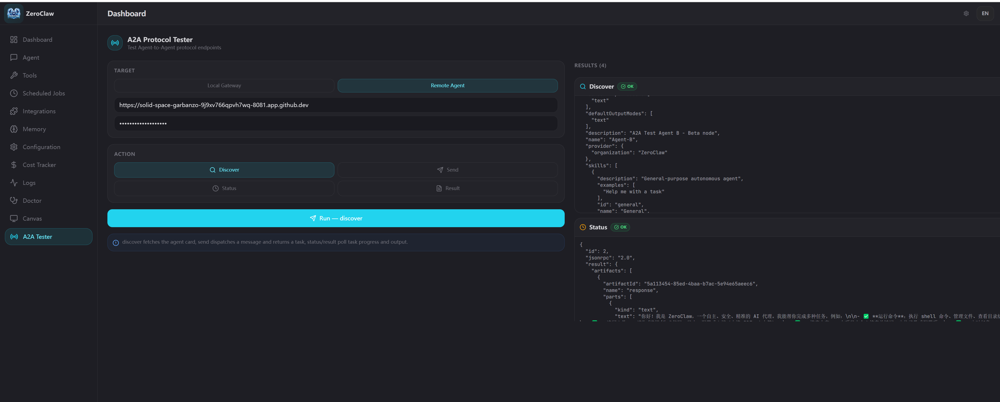

# ZeroClaw 多 Agent A2A 通信测试报告

> 环境：GitHub Codespaces
> 版本：v0.6.4
> 协议：A2A (Agent-to-Agent) Protocol MVP

---

## 一、目标

在 GitHub Codespaces 环境中启动两个独立的 ZeroClaw 实例（Agent-A、Agent-B），通过 A2A 协议实现跨 Agent 通信，并在 Agent-A 的 Web UI 页面中完成端对端测试。

---

## 二、配置修改

### Agent-A 配置（`/tmp/zeroclaw-a/config.toml`）

```toml
default_provider = "qwen"
default_model = "qwen-plus"
default_temperature = 0.7
api_key = "<your-api-key>"

[gateway]
port = 8080
host = "0.0.0.0"
allow_public_bind = true
require_pairing = false

[a2a]
enabled = true
agent_name = "Agent-A"
description = "A2A Test Agent A - Alpha node"
public_url = "https://<CODESPACE_NAME>-8080.app.github.dev"
bearer_token = "a2a-shared-secret"
allow_local = true

[cost]
enabled = false
```

关键配置项说明：

| 配置项 | 值 | 原因 |
|---|---|---|
| `gateway.host` | `0.0.0.0` | 绑定所有网卡，Codespaces 端口转发需要 |
| `gateway.allow_public_bind` | `true` | 允许绑定非 localhost，否则启动报错 |
| `gateway.require_pairing` | `false` | 测试阶段关闭配对验证，简化测试流程 |
| `a2a.enabled` | `true` | 开启 A2A 服务端和出站工具 |
| `a2a.public_url` | Codespaces 公网域名 | Agent Card 中对外声明的服务地址，必须是外部可达的 URL |
| `a2a.bearer_token` | `a2a-shared-secret` | A2A 请求认证 Token，两端保持一致 |
| `a2a.allow_local` | `true` | 允许出站 A2A 工具访问本地地址（开发环境用） |
| `cost.enabled` | `false` | 关闭费用追踪，防止预算上限拦截测试请求（见附注） |

> **`cost.enabled` 说明**
>
> `[cost]` 是 ZeroClaw 的费用追踪与预算管控模块，**默认开启**。开启时会统计每次 LLM 调用的 token 消耗和估算费用，并在达到预算阈值（默认日限 $10、月限 $100）时触发告警或拦截。
>
> 测试配置中将其关闭，是为了避免在 A2A 通信验证过程中因触发预算上限导致请求被意外拦截。**正式部署时建议去掉此行（保持默认开启），或根据实际需求配置 `daily_limit_usd` / `monthly_limit_usd`。**

---

### Agent-B 配置（`/tmp/zeroclaw-b/config.toml`）

```toml
default_provider = "qwen"
default_model = "qwen-plus"
default_temperature = 0.7
api_key = "<your-api-key>"

[gateway]
port = 8081
host = "0.0.0.0"
allow_public_bind = true
require_pairing = false

[a2a]
enabled = true
agent_name = "Agent-B"
description = "A2A Test Agent B - Beta node"
public_url = "https://<CODESPACE_NAME>-8081.app.github.dev"
bearer_token = "a2a-shared-secret"
allow_local = true

[cost]
enabled = false
```

与 Agent-A 的差异：

| 配置项 | Agent-A | Agent-B |
|---|---|---|
| `gateway.port` | `8080` | `8081` |
| `a2a.agent_name` | `Agent-A` | `Agent-B` |
| `a2a.description` | Alpha node | Beta node |
| `a2a.public_url` | `...-8080.app.github.dev` | `...-8081.app.github.dev` |

两个实例的 `bearer_token` 相同（`a2a-shared-secret`），使 Agent-A 可以直接向 Agent-B 发起认证请求。

---

### Strands-Qwen Agent（Python，端口 9000）

这是一个基于 **Strands Agents SDK** 的第三方 A2A 实现，用于验证 ZeroClaw 与 Python 框架的跨框架互通。

**依赖安装：**

```bash
cd python
pip install -r requirements-strands.txt
```

**启动脚本：** `python/strands_a2a_server.py`

完整脚本内容：

```python
"""
Strands Agents A2A Server (with CORS support)
=============================================
A Python A2A-compatible agent powered by Strands Agents SDK and Qwen LLM.
Runs on port 9000 and can communicate with ZeroClaw agents via the A2A protocol.

Features:
- CORS enabled for cross-origin requests from ZeroClaw UI
- /a2a endpoint for ZeroClaw compatibility (Strands uses / by default)
- Qwen LLM via OpenAI-compatible API
- Tools: http_request, shell, file_read, file_write
"""

import logging
import os

import httpx
import uvicorn
from openai import AsyncOpenAI
from starlette.applications import Starlette
from starlette.middleware.cors import CORSMiddleware
from starlette.requests import Request
from starlette.responses import Response
from starlette.routing import Mount, Route
from strands import Agent
from strands.models.openai import OpenAIModel
from strands.multiagent.a2a import A2AServer
from strands_tools import file_read, file_write, http_request, shell

logging.basicConfig(
    level=logging.INFO,
    format="%(asctime)s [%(levelname)s] %(name)s: %(message)s",
)
logger = logging.getLogger(__name__)

# ── Configuration ─────────────────────────────────────────────────

API_KEY = os.environ.get("QWEN_API_KEY") or os.environ.get("API_KEY")
if not API_KEY:
    raise RuntimeError("QWEN_API_KEY environment variable is required")

PORT = int(os.environ.get("PORT", "9000"))
HOST = "0.0.0.0"

# Derive public URL for agent card (auto-detect in Codespaces)
CODESPACE_NAME = os.environ.get("CODESPACE_NAME", "")
if CODESPACE_NAME:
    PUBLIC_URL = f"https://{CODESPACE_NAME}-{PORT}.app.github.dev"
else:
    PUBLIC_URL = f"http://localhost:{PORT}"

# ── LLM Model ────────────────────────────────────────────────────

qwen_client = AsyncOpenAI(
    api_key=API_KEY,
    base_url="https://dashscope.aliyuncs.com/compatible-mode/v1",
)

model = OpenAIModel(client=qwen_client, model_id="qwen-plus")

# ── Agent ─────────────────────────────────────────────────────────

agent = Agent(
    model=model,
    name="Strands-Qwen Agent",
    description="A Strands Agents A2A node for cross-framework interop testing with ZeroClaw.",
    tools=[http_request, shell, file_read, file_write],
    system_prompt=(
        "You are a helpful AI assistant powered by Qwen via Strands Agents. "
        "You can execute shell commands, read/write files, and make HTTP requests."
    ),
)

# ── A2A Server with CORS and /a2a route ───────────────────────────

a2a_server = A2AServer(agent=agent, host=HOST, port=PORT, http_url=PUBLIC_URL)
a2a_app = a2a_server.to_starlette_app()


# Proxy /a2a -> / for ZeroClaw compatibility
async def a2a_proxy(request: Request) -> Response:
    body = await request.body()
    async with httpx.AsyncClient() as client:
        response = await client.post(
            f"http://localhost:{PORT}/",
            content=body,
            headers={
                "Content-Type": request.headers.get("Content-Type", "application/json"),
            },
            timeout=60.0,
        )
        return Response(
            content=response.content,
            status_code=response.status_code,
            headers={"Content-Type": "application/json", "Access-Control-Allow-Origin": "*"},
        )


# Routes: /a2a must be before /*
routes = [
    Route("/a2a", a2a_proxy, methods=["POST"]),
    Mount("/", app=a2a_app),
]

app = Starlette(routes=routes)
app.add_middleware(
    CORSMiddleware,
    allow_origins=["*"],
    allow_credentials=True,
    allow_methods=["*"],
    allow_headers=["*"],
)

# ── Entrypoint ────────────────────────────────────────────────────

if __name__ == "__main__":
    logger.info("Starting Strands A2A server on %s:%d", HOST, PORT)
    logger.info("Agent card: %s/.well-known/agent-card.json", PUBLIC_URL)
    uvicorn.run(app, host=HOST, port=PORT)
```

**启动命令：**

```bash
export QWEN_API_KEY=<your-key>
python python/strands_a2a_server.py
```

**Strands Agent 与 ZeroClaw Agent 的关键差异：**

| 特性 | Strands Agent | ZeroClaw Agent |
|---|---|---|
| 实现语言 | Python | Rust |
| SDK | Strands Agents | ZeroClaw 原生 |
| LLM 后端 | Qwen via OpenAI 兼容接口 | Qwen 原生 |
| 默认端口 | `9000` | `42617` |
| 认证 | 默认无 bearer token | `a2a-shared-secret` |
| 流式支持 | `streaming: true` | 未实现（MVP） |
| 工具注册 | `strands_tools` 自动暴露 | 需手动配置 |

Strands A2A 实例默认无 bearer token 认证，ZeroClaw 调用时留空 Bearer Token 即可。

---

## 三、关于配置目录的选择

### 测试环境（本文使用）

本文使用 `/tmp/zeroclaw-a` 和 `/tmp/zeroclaw-b` 作为配置目录，原因是 `/tmp` 创建快速，无需关心清理，适合一次性测试。

**注意：`/tmp` 是临时目录，系统重启后会被清空**，其中的会话数据、workspace 等均不会保留，仅适用于临时测试。

### 正式部署

ZeroClaw 的默认配置目录是 `~/.zeroclaw/`，不加 `--config-dir` 参数时进程自动读取 `~/.zeroclaw/config.toml`。

多实例正式部署的推荐做法是使用具名的持久化目录：

```bash
# 目录结构示例
~/.zeroclaw-agent-a/config.toml
~/.zeroclaw-agent-b/config.toml
```

启动：

```bash
zeroclaw --config-dir ~/.zeroclaw-agent-a gateway start
zeroclaw --config-dir ~/.zeroclaw-agent-b gateway start
```

数据、workspace、SQLite 会话等均持久化在各自目录下，重启后不丢失。若只部署单实例，直接使用默认目录 `~/.zeroclaw/` 即可，无需任何额外参数。

---

## 四、Codespaces 启动步骤

### 1. 准备独立配置目录

每个实例需要独立的配置目录，避免互相干扰：

```bash
mkdir -p /tmp/zeroclaw-a /tmp/zeroclaw-b
```

将各自的 config.toml 写入对应目录（注意将 `<CODESPACE_NAME>` 替换为实际值）：

```bash
# 查看当前 Codespace 名称
echo $CODESPACE_NAME
```

`public_url` 格式为：

```
https://<CODESPACE_NAME>-<PORT>.app.github.dev
```

### 2. 启动三个实例

**ZeroClaw Agent-A / Agent-B：**

使用 `--config-dir` 指定配置目录（不能用环境变量，必须用此参数）：

```bash
# 启动 Agent-A（后台运行）
zeroclaw --config-dir /tmp/zeroclaw-a gateway start > /tmp/agent-a.log 2>&1 &

# 启动 Agent-B（后台运行）
zeroclaw --config-dir /tmp/zeroclaw-b gateway start > /tmp/agent-b.log 2>&1 &
```

确认启动成功（日志中应出现 `A2A protocol enabled`）：

```bash
cat /tmp/agent-a.log
cat /tmp/agent-b.log
```

**Strands Agent（Python，端口 9000）：**

```bash
export QWEN_API_KEY=<your-key>
python python/strands_a2a_server.py > /tmp/strands-a2a.log 2>&1 &
```

确认启动成功（日志中应出现 `Uvicorn running on http://0.0.0.0:9000`）：

```bash
cat /tmp/strands-a2a.log
```

### 3. 开放 Codespaces 端口可见性

Codespaces 端口默认为 **Private**，浏览器跨端口请求会被拦截，导致 UI 中的 Remote Agent 测试失败。

操作步骤：
1. 打开 VS Code 底部 **Ports** 面板（或 GitHub Codespaces 网页的 Ports 标签）
2. 找到端口 `8080`、`8081` 和 `9000`
3. 右键 → **Port Visibility** → 改为 **Public**（或 Organization）

### 4. 验证端点可用性

```bash
# 验证 Agent-A
curl http://localhost:8080/.well-known/agent-card.json

# 验证 Agent-B
curl http://localhost:8081/.well-known/agent-card.json

# 验证 Strands Agent
curl http://localhost:9000/.well-known/agent-card.json
```

三者均应返回包含各自 `agent_name` 和 Codespaces `public_url` 的 JSON。Strands Agent 的响应中 `capabilities.streaming` 为 `true`，与 ZeroClaw 的 `false` 不同，体现跨框架差异。

---

## 五、在 Agent-A UI 中测试 A2A 通信

打开 Agent-A 的 Web Dashboard：

```
https://<CODESPACE_NAME>-8080.app.github.dev
```

进入左侧菜单 **A2A Test** 页面。

### 5.1 测试与 Agent-B（ZeroClaw）的通信

点击 **Remote Agent** 切换到远端模式，填写：

| 字段 | 填写值 |
|---|---|
| Agent URL | `https://<CODESPACE_NAME>-8081.app.github.dev` |
| Bearer Token | `a2a-shared-secret` |

#### 测试步骤

**Step 1 — 发现（discover）**

选择 `discover`，点击 Run。

调用 `GET <Agent-B URL>/.well-known/agent-card.json`，成功后返回 Agent-B 的能力声明，确认通信链路正常。

**Step 2 — 发送消息（send）**

选择 `send`，在 Message 框输入内容，点击 Run。

调用 `POST <Agent-B URL>/a2a`（JSON-RPC `message/send`），Agent-B 的 LLM 处理后返回结果。响应卡片中包含 `task_id`，点击 **Use Task ID** 可自动填入。

**Step 3 — 查询状态（status）**

选择 `status`，Task ID 已自动填入，点击 Run。

查询 Agent-B 上该任务的执行状态（`submitted` / `working` / `completed` / `failed`）。

**Step 4 — 获取结果（result）**

选择 `result`，点击 Run。

获取 Agent-B 返回的 artifacts（完整响应内容）。

---

### 5.2 测试与 Strands Agent（Python）的跨框架通信

点击 **Remote Agent** 切换到远端模式，填写：

| 字段 | 填写值 |
|---|---|
| Agent URL | `https://<CODESPACE_NAME>-9000.app.github.dev` |
| Bearer Token | （留空，Strands 默认无认证） |

#### 测试步骤

与 5.1 相同，执行 discover → send → status → result。

**预期差异：**
- Strands Agent 的 agent card 中 `capabilities.streaming: true`（ZeroClaw 为 `false`）
- Strands Agent 的 `skills` 列表包含 `http_request`、`shell`、`file_read`、`file_write` 等工具描述
- 由于 Strands 和 ZeroClaw 的 LLM 后端相同（均为 Qwen），响应质量应相当

---

## 六、实际运行截图

以下截图来自 Agent-A 的 Web Dashboard A2A Tester 页面，展示完整测试流程。

**截图 1 — Discover：拉取 Agent-B 的 Agent Card**



目标设置为 Remote Agent，填入 Agent-B 的 Codespaces 公网地址后执行 Discover。右侧结果面板返回 Agent-B 的 agent card，包含 `name: "Agent-B"`、`description`、`skills` 等字段，同时展示了 Status 查询的 `completed` 状态，确认通信链路正常。

---

**截图 2 — Send：向 Agent-B 发送消息**


在 Message 框输入"你好，你能做什么"，执行 Send。Agent-B 的 LLM 自主处理后返回完整回复，结果卡片中包含 `task_id` 和 `status: completed`，点击 Use Task ID 可将 task_id 自动填入后续查询。

---

**截图 3 — Status：通过 task_id 查询任务状态**


将上一步返回的 task_id（`a08f9315-a1db-4762-9ca8-c9e8fc16928d`）填入 Task ID 框，执行 Status。Agent-B 返回该任务的完整状态，`state: completed`，artifacts 中包含实际响应内容。

---

## 七、常见问题

**启动时报 `Address already in use`**

两个实例读取了同一份配置（默认 `~/.zeroclaw/config.toml`），未使用 `--config-dir` 参数，或两份配置的端口相同。

**`discover` 在 UI 中报网络错误**

Codespaces 端口可见性为 Private，需按第四节第 3 步将 8080、8081 改为 Public。

**`send` 返回 HTTP 401**

`bearer_token` 填写错误，或 Agent-B 配置中 `bearer_token` 与请求中的值不一致。

**agent card 中 `url` 仍是 `localhost`**

`a2a.public_url` 未更新为 Codespaces 域名，重新修改配置后重启实例。
